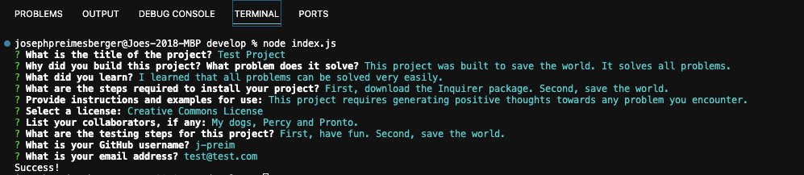
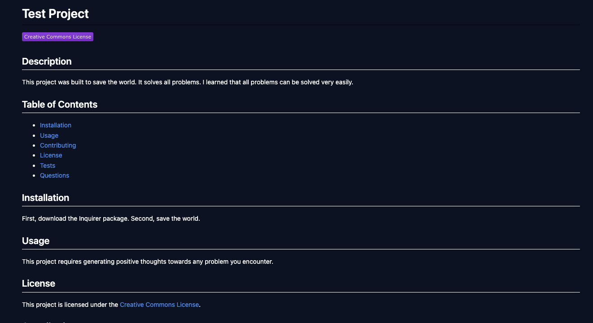

# Professional README Generator

## Description

The purpose of this project is to create a command-line application that dynamically generates a professional README.md file from a user's input using the Inquirer package. This functionality allows any project creator to devote more time to working on their project.

## Installation

A video showing the functionality of this project can be found here: https://j-preim.github.io/readme-generator/

## Usage

The application takes in user input as shown in the following screenshot:

The finished README file will appear as it does in the following screenshot:

## Credits

N/A

## License

Copyright (c) 2023 Joe Preimesberger

Licensed under the MIT license.